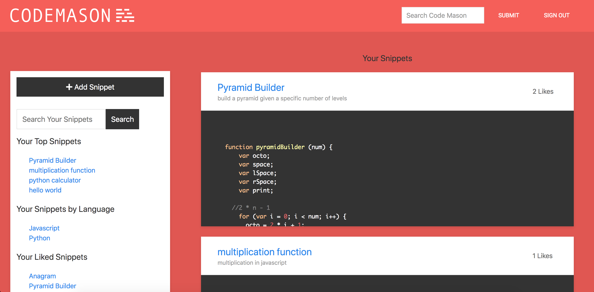
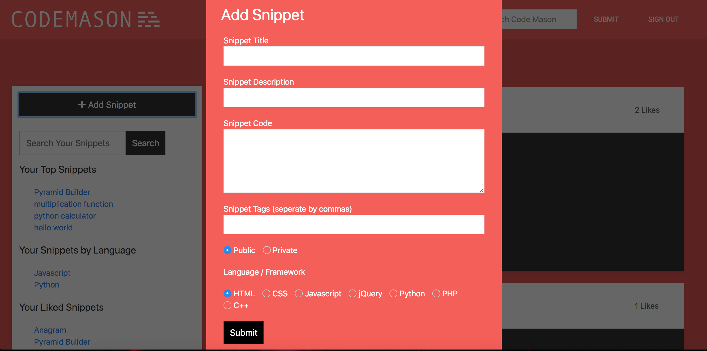
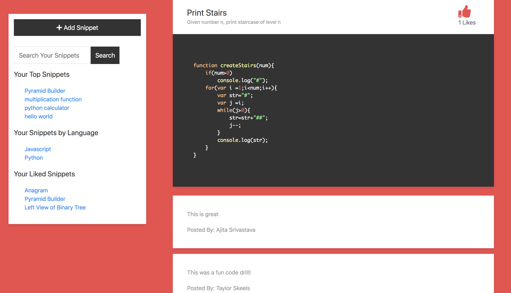

# Code-Mason

## About
Code-Mason is a full-stack single-page application built on MVC architecture that provides code-storing, code-searching and code-sharing, code-discussing capabilities to the users. It uses sequeslize ORM to interact with the back-end database server and HTML,CSS,jQuery on the front-end.


## Deployed Link
[Code-Mason](https://code-mason.herokuapp.com)

## Application Preview

### User Not Signed-In


### User Signed-In


### User Add Snippet Modal


### Single Snippet View with Comments


## Technologies used
1. HTML5
2. CSS3/UIKit/Highlight.js
3. jQuery
4. Node.js
5. Express.js
6. Sequelize with MySQL dialect
7. Google Sign-In

## Node Packages used
1. express
    * usage
    ```require("express")```
    * It is a fast, unopinionated, minimalist web framework for node.
    * For more information: [express](https://expressjs.com)

2. mysql
    * usage
    ```require("mysql")```
    * A node package that is used to connect to mysql server and thus allows us to run queries on database tables; It also aloows us to delete, update or insert into the database tables.
    * For more information: [mysql](https://www.npmjs.com/package/mysql)

3. body-parser
    * usage
    ```require("body-parser")```
    * Node.js body parsing middleware.Parses incoming request bodies in a middleware before handlers, available under the req.body property.
    * For more information: [body-parser](https://www.npmjs.com/package/body-parser)

4. sequelize
    * usage
    ```sequelize init:config```
    ```sequelize init:models```
    * It is a promise-based ORM for Node.js. These two command when run on terminal after npm install sequelize create 2 files config.json and index.js. Config.json will provide the configuartion for connecting to database while index.js imports sequelize and creates an object 'db' that is exported. This object contains all the models as a key. When imported on a controller page, these keys can be used to access the models.
    * For more infromation: [sequelize](http://docs.sequelizejs.com)

## Execution steps on local machine
1. Make sure node is installed on your machine. You can visit the website [Node Installation](http://blog.teamtreehouse.com/install-node-js-npm-mac) for instructions.
2. Download/Clone the respository.
3. On terminal, go inside Code-Mason folder and type npm install. This will install all the dependencies required to run the application mentioned in package.json.
4. Make sure mysql is installed on the localhost/other server.
5. Log into mysql workbench and execute db/schema.sql from the repository. This will create the database on the server.
6. Open config.json and change development.user, development.password with your values.
7. Inside Code-Mason folder on terminal, type "node server.js" on terminal. This will start the server.
8. Open the browser and type "localhost:8080". This will start executing the client part of the application.


## Code snippets
### server
```
app.use(express.static("public"));

app.use(bodyParser.urlencoded({ extended: true }));

app.use(bodyParser.json());

require("./routes/api-routes.js")(app);
require("./routes/html-routes.js")(app);

```
This code snippet shows how server gets the access to the controllers' functionalities and how the server starts listening on the mentioned port.

### models

#### User
```
var User = sequelize.define("User", {
      name: {
          type: DataTypes.STRING,
          allowNull: false,
          validate :
                    {
                        notEmpty: true
                    }
      },
      email : {
          type: DataTypes.STRING,
          allowNull : false,
          validate :
                {
                    isEmail: true
                }
      }
});
```
#### Code
```
var Code = sequelize.define("Code", {
      title: {
          type: DataTypes.STRING,
          allowNull: false,
          validate :
                    {
                        notEmpty: true
                    }
      },
      description: {
        type: DataTypes.STRING,
        allowNull: false,
        validate :
                  {
                      notEmpty: true
                  }
      },
      text: {
          type: DataTypes.TEXT('long'),
          allowNull: false,
          validate :
                    {
                        notEmpty: true
                    }
      },
      public: {
          type: DataTypes.BOOLEAN,
          defaultValue:true,
          allowNull: false
      },
      likes: {
          type: DataTypes.INTEGER,
          defaultValue:0
      },
      language: {
          type: DataTypes.STRING,
          allowNull : false
      }
});
```
#### Comment
```
var Comment = sequelize.define("Comment", {
    text: {
        type: DataTypes.TEXT,
        allowNull: false,
        validate :
                  {
                      notEmpty: true
                  }
    }
});
```
#### Tag
```
var Tag = sequelize.define("Tag", {
      tagname: {
          type: DataTypes.STRING,
          allowNull: false,
          validate :
                    {
                        notEmpty: true
                    }
      }
});
```
#### Like
```
 var Like = sequelize.define("Like", {

});
```

### model relationship

A user can have many codes, many comments and many likes
```
User.associate = function (models) {
    models.User.hasMany(models.Code, {
        onDelete: "cascade"
    });
    models.User.hasMany(models.Comment, {
        onDelete: "cascade"
    });
    models.User.hasMany(models.Like, {
        onDelete: "cascade"
    });
}
```

A code can have one User, many comments, many tags, many likes
```
Code.associate = function (models) {
    models.Code.belongsTo(models.User, {
        foreignKey: {
        allowNull: false
        }
    });
    models.Code.hasMany(models.Comment, {
        onDelete: "cascade"
    });
    models.Code.hasMany(models.Tag, {
        onDelete: "cascade"
    });
    models.Code.hasMany(models.Like, {
        onDelete: "cascade"
    });
}
```

A comment can have one code and one user who wrote it.
```
Comment.associate = function (models) {
    models.Comment.belongsTo(models.User, {
    foreignKey: {
        allowNull: false
    }
    });
    models.Comment.belongsTo(models.Code, {
        foreignKey: {
        allowNull: false
        }
    });
}
```

A tag can belong to one code
```
Tag.associate = function (models) {
    models.Tag.belongsTo(models.Code, {
        foreignKey: {
        allowNull: false
        }
    });
}
```

A like can belong to one code and one user who liked it.
```
Like.associate = function (models) {
    models.Like.belongsTo(models.Code, {
    foreignKey: {
        allowNull: false
    }
    });
    models.Like.belongsTo(models.User, {
        foreignKey: {
        allowNull: false
        }
    });
}
```

### view
When a user is created, logs in, or is currently logged in this Google Sign In function runs to verify the login and then calls the renderPageCheck function.

```
function onSignIn(googleUser) {
  //user data from google sign in
  var profile = googleUser.getBasicProfile();
  var name = profile.getName();
  var email = profile.getEmail();

  //get user id
  $.get("/user/" + email, function(res){  
    if (res) {
      //set session storage with user id
      sessionStorage.setItem("userID", res.id);
      renderPageCheck();
    }
    // if user id does not exist create a new user
    else {
      $.post("/users", {name: name, email: email}, function(res){
        //set session storage with user id
        sessionStorage.setItem("userID", res.id);
        window.location.reload();
      });
    }
  });
}
```

When the page loads this function checks if a user is logged in & then calls the appropriate functions to render the public or user page
```
$(document).ready(function() {
    renderPageCheck();
})
```
```
function renderPageCheck() {
if (sessionStorage.getItem("userID")) {
    var userID = sessionStorage.getItem("userID");
    $(".recent-snippets").empty();
    renderUserSnippets(userID);
    renderAddSnippet();
    sidebarSnippetSearch(userID);
    userTopSnippets(userID);
    languageSort(userID);
    userFavoriteSnippets();
    logInHide();
    logOutShow();
}

else {
    renderTopSnippets(includeHilights);
    RenderPubliclanguages();
    publicRecentSnippets();
}
}
```
One example of our dynamically generated content
```
function renderSingleSnippet(singleSnippet){
    $.get("/codes/code/" + singleSnippet, function(result) {
        console.log("SINGLE SNIPPET RESULT: " , result);
         $(".snippets-container").empty();
         $("#comments-container").remove();

        $(".snippets-container").append(`<div class='uk-card uk-card-default'>
                                            <div class='uk-card-header'>
                                                <div class='uk-grid-small uk-flex-middle' uk-grid>
                                                    <div class='uk-width-expand'>
                                                        <h3 class='uk-card-title uk-margin-remove-bottom'>`+result.title+`</h3>
                                                        <p class='uk-text-meta uk-margin-remove-top'>`+result.description+`</p>
                                                    </div>
                                                    <div class='render-likes-div'>
                                                        <p class='like-button'>
                                                            <button type='button' data-snippetID='`+result.id+`' class='add-like icon-style'>
                                                                <i class='fas fa-thumbs-up fa-2x'></i>
                                                            </button>
                                                        </p>
                                                        <p class='total-likes'>`+result.likes+ ` Likes</p>
                                                    </div>
                                                </div>
                                            </div>
                                            <div class='uk-card-body snippet-render-area single-snippet-render-area'>
                                                <p><pre><code>`+result.text.replace(/\</g,"&lt;")+`</code></pre></p>
                                            </div>
                                            <div class='delete-div uk-card-footer'></div>
                                        </div>`);
        $(".snippets-container").append('<div id="comments-container"></div>');

        if (parseInt(sessionStorage.getItem("userID")) === result.UserId) {
          $(".delete-div").html("<button type='button' data-snippetID='"+ result.id +"' class='delete-snippet icon-style'><i class='fas fa-trash-alt'></i></button>")  
        }
        else {
          $(".delete-div").hide();
        }
        renderSnippetComments(singleSnippet);
        includeHilights();
    })
}
```

### controller
Controller has all the information about the model and it according to the requests renders appropriate view.

Getting userID given their email
```
app.get("/user/:email", function(req, res) {
    db.User.findOne({
        attributes :['id'],
       where:
       {
           email:req.params.email
       }
    }).then(function(data){
        console.log(data);
        res.json(data);
    });
});
```

Getting top 10 codes most liked public codes
```
app.get("/top10", function(req, res) {
    db.Code.findAll({
        order: [['likes', 'DESC']],
        limit: 10
    }).then(function(data){
        console.log(data);
        res.json(data);
    });
});
```

Getting top 5 most recent codes
```
app.get("/codes/latest", function(req,res){
    db.Code.findAll({
        order: [['updatedAt', 'DESC']],
        limit: 5
    }).then(function(data){
        res.json(data);
    });
});
```

Getting the likeId given a userID and codeID to check if the user has already liked this particular code or not.
```
app.get("/likes/user/:userID/code/:codeID", function(req,res){
    db.Like.findOne({
        attributes:['id'],
        where:
        {
            codeId:req.params.codeID,
            userID:req.params.userID
        }
    }).then(function(data){
        res.json(data);
    });
});
```

Getting a particular code by id
```
app.get("/codes/code/:codeID", function(req,res){
    db.Code.findOne({
        where: {
            id:req.params.codeID
        }
    }).then(function(data){
        console.log(data.text);
        res.json(data);
    });
});
```

Getting all comments and their commentators of a particular code
```
app.get("/comments/code/:codeID", function(req,res){
    db.Comment.findAll({
        include:[db.User],
        where: {
            CodeId:req.params.codeID
        }
    }).then(function(data){
        res.json(data);
    });
});
```

Getting all languages used by a particular user
```
app.get("/languages/user/:userID", function(req,res){
    db.Code.findAll({
        attributes :[[db.Sequelize.fn('DISTINCT', db.Sequelize.col('language')) ,'language']],
        where: {
            UserId:req.params.userID
        }
    }).then(function(data){
        res.json(data);
    });
});
```

Getting list of all distinct languages used by all users
```
app.get("/languages", function(req,res){
    db.Code.findAll({
        attributes :[[db.Sequelize.fn('DISTINCT', db.Sequelize.col('language')) ,'language']],
        where:{
            public:true
        }
    }).then(function(data){
        res.json(data);
    });
});
```

Getting all codes of a particular user
```
app.get("/codes/user/:userID", function(req,res){
    db.Code.findAll({
        where: {
            UserId:req.params.userID
        }
    }).then(function(data){
        res.json(data);
    });
});
```

Getting 5 most recently modified codes of a particular user
```
app.get("/codes/latest/user/:userID", function(req,res){
    db.Code.findAll({
        where: {
            UserId:req.params.userID
        },
        order: [['updatedAt', 'DESC']],
        limit: 5
    }).then(function(data){
        res.json(data);
    });
});
```

Getting 5 most liked codes of a particular user
```
app.get("/codes/liked/user/:userID", function(req,res){
    db.Code.findAll({
        where: {
            UserId:req.params.userID
        },
        order: [['likes', 'DESC']],
        limit: 5
    }).then(function(data){
        res.json(data);
    });
});
```

Getting total likes for a particular code
```
app.get("/codes/likes/:codeID", function(req,res){
    db.Code.findOne({
        attributes:['likes'],
        where: {
            id:req.params.codeID
        }
    }).then(function(data){
        res.json(data);
    });
});
```

Getting all the codes that a particular user has liked
```
app.get("/codes/likes/user/:userID", function(req,res){
    db.Code.findAll({
        include :[{
                model: db.Like,
                as: 'Likes'
        }],
        where :
                {
                    '$Likes.UserId$': req.params.userID
                }
    }).then(function(data){
        res.json(data);
    });
});
```

Getting all codes that have a particular keyword in its tag or title
```
app.get("/search/codes/word/:keyword", function(req,res){
    db.Code.findAll({
        include : [{
            model: db.Tag,
            as :'Tags'
        }],
        where: {
            public : true,
            $or: [
                {title :
                                {
                                    $like: '%'+req.params.keyword+'%'
                                }
                },
                {'$Tags.tagname$' :
                                 {
                                    $like: '%'+req.params.keyword+'%'
                                 }
                }
            ]
        }
    }).then(function(data){
        res.json(data);
    })
});
```

Getting a user's codes that have a particular keyword in its tag or its title
```
app.get("/search/codes/user/:userID/word/:keyword", function(req,res){
    db.Code.findAll({
        where: {
            UserId:req.params.userID,
            $or: [
                {title :
                                {
                                    $like: '%'+req.params.keyword+'%'
                                }
                },
                {'$Tags.tagname$' :
                                {
                                    $like: '%'+req.params.keyword+'%'
                                }
                }
            ]
        },
        include : [{
            model: db.Tag,
            as :'Tags'
        }]
    }).then(function(data){
        res.json(data);
    })
});
```

Getting all codes for a particular language
```
app.get("/search/codes/language/:language", function(req,res){
    db.Code.findAll({
        where :
        {
            public : true,
            language: req.params.language
        }
    }).then(function(data){
        res.json(data);
    });
});
```

Getting all codes for a particular language for a particular user
```
app.get("/search/codes/language/:language/user/:userID", function(req,res){
    db.Code.findAll({
        where :
        {
            language: req.params.language,
            userID : req.params.userID
        }
    }).then(function(data){
        res.json(data);
    });
});
```

Adding a new comment with the id of the code and the user's id who has commented on it
```
app.post("/comments", function(req,res){
    db.Comment.create({
        text: req.body.text,
        CodeId: req.body.codeID,
        UserId: req.body.userID
    }).then(function(data){
        res.json({ id: data.insertId });
    });
});
```

Adding a new code
```
app.post("/codes", function(req,res){
    db.Code.create({
        title: req.body.title,
        description: req.body.description,
        text: req.body.text,
        public: req.body.public,
        likes: req.body.likes,
        language:req.body.language,
        UserId: req.body.userID
    }).then(function(data){
        res.json({ id: data.insertId });
    });
});
```

Adding new tag
```
app.post("/tags", function(req,res){
    db.Tag.create({
        tagname: req.body.tagname,
        CodeId : req.body.codeID
    }).then(function(data){
        res.json({ id: data.insertId });
    })
});
```

Adding a new like with userid of user who liked it and the codeid that he liked.
```
app.post("/likes", function(req,res){
    db.Like.create({
        UserId: req.body.userID,
        CodeId : req.body.codeID
    }).then(function(data){
        res.json({ id: data.insertId });
    })
});
```

Adding new user
```
app.post("/users", function(req,res){
    db.User.create({
        name: req.body.name,
        email: req.body.email
    }).then(function(data){
        res.json({ id: data.insertId });
    })
});
```

Increments the number of likes for a code
```
app.put("/code/likes/:codeID", function(req, res) {
    db.Code.update({
        likes: db.Sequelize.literal('likes + 1'),
    },{
      where:
      {
        id:req.params.codeID
      }
    }).then(function(data){
      res.json(data);
    });
  });
```

Deletes a code
```
app.delete("/codes/code/:codeID", function(req,res){
    db.Code.destroy({
        where:
        {
          id:req.params.codeID
        }
      }).then(function(data){
        if (data.affectedRows === 0) {
          // If no rows were changed, then the ID must not exist, so 404
          return res.status(404).end();
        } else {
          res.status(200).end();
        }
      });
});
```

## Learning points
1. Creating a full stack web application.
2. Learning how the server and client interact with requests and responses.
3. How to create a server and how it starts listening for the clients' requests on a particular port.
4. How the models, controllers and views interact in MVC architecture. We also used callbacks in this app for this interaction.
5. Various types of ajax client requests i.e post,get,put,delete to database server
6. Sending various types of responses to clients including serving an html page or sending back data as json object.
7. How to query on database using a req.body or req.params
8. Using sequelize package to interact with mysql server. This included creating connection, reading, updating, creating, deleting data using sequelize methods.
9. Using Highlight.js for better user experience.
10. Incorporating google sign-in in the appliction
11. Deploying application on heroku.


## Authors
* [Ajita Srivastava Github](https://github.com/ajitas)  |  [Ajita Srivastava Portfolio](https://ajitas.github.io/Portfolio/)

* [Taylor Skeels Github](https://github.com/skeeis)  |  [Taylor Skeels Portfolio](https://skeeis.github.io/Personal-Portfolio/)

* [Craig Melville Github](https://github.com/acekreations)  |  [Craig Melville Portfolio](https://acekreations.github.io/Portfolio/)

## License
Standard MIT License
